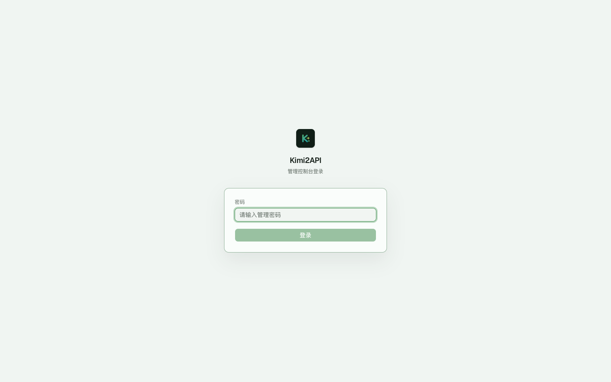
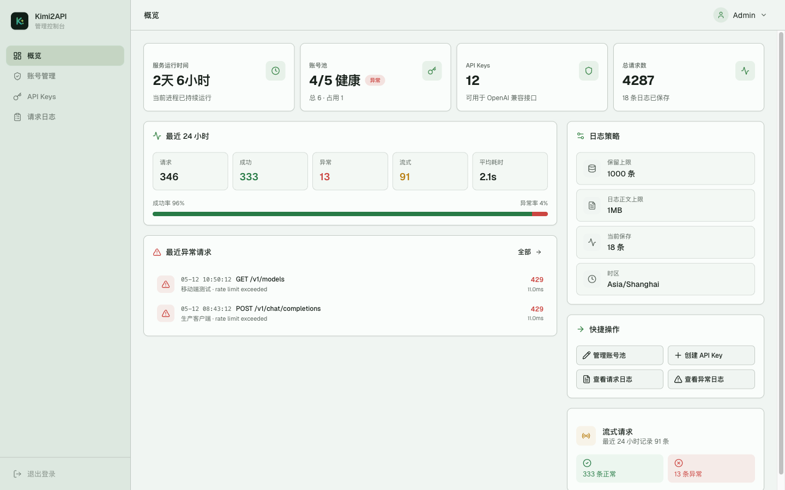
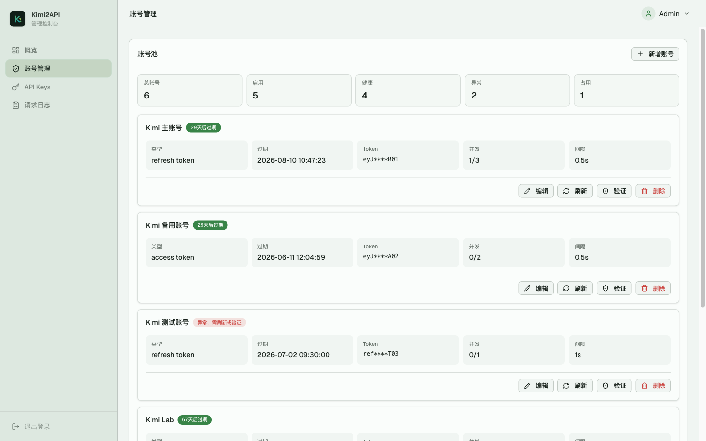
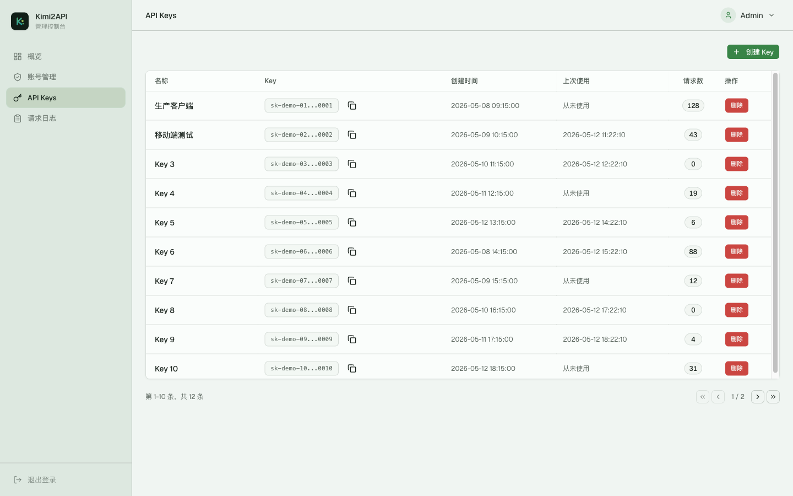
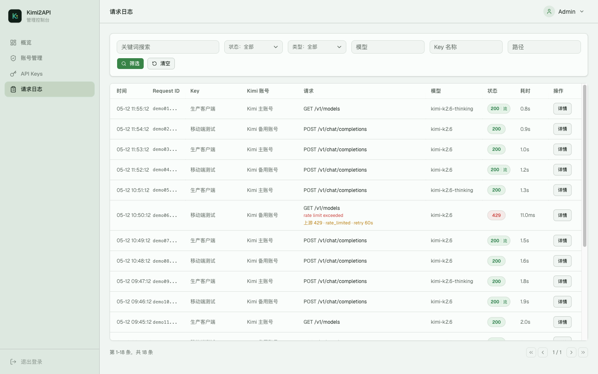
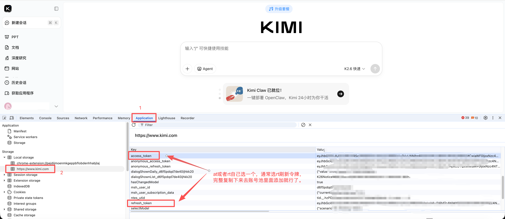

# Kimi2API

Kimi2API 是一个基于 Kimi Web 协议封装的 OpenAI 兼容 API 服务。它把 Kimi 的聊天能力转换成常见的 `/v1` 接口，方便 OpenAI SDK、Cherry Studio、LobeChat、NextChat、one-api 风格客户端接入。
_（简单来说，这就是用来玩酒馆的，没有做toolcall之类编程方向的优化，因为2api的能力懂得都懂）_

项目内置 React 管理面板，支持 Kimi 账号池、对外 API Key、请求日志、运行概览和基础运维操作。

> 说明：本项目不是 Moonshot 官方 API，也不是完整 OpenAI API 实现。它只实现当前代码中列出的兼容接口，实际可用模型和能力取决于 Kimi Web 返回的数据。

## 界面预览

以下截图使用脱敏演示数据，仅用于展示管理面板布局。点击下方宫格可在当前 README 中展开大图，再次点击可收起。

<details>
  <summary>
    <strong>点击展开 / 收起界面大图</strong>
    <br><br>
    <table>
      <tr>
        <td align="center" width="33%">
          <picture>
            
          </picture>
          <br>
          <sub>登录页</sub>
        </td>
        <td align="center" width="33%">
          <picture>
            
          </picture>
          <br>
          <sub>概览</sub>
        </td>
        <td align="center" width="33%">
          <picture>
            
          </picture>
          <br>
          <sub>账号管理</sub>
        </td>
      </tr>
      <tr>
        <td align="center" width="33%">
          <picture>
            
          </picture>
          <br>
          <sub>API Keys</sub>
        </td>
        <td align="center" width="33%">
          <picture>
            
          </picture>
          <br>
          <sub>请求日志</sub>
        </td>
        <td width="33%"></td>
      </tr>
    </table>
  </summary>

### 登录页

<picture>
  
</picture>

### 概览

<picture>
  
</picture>

### 账号管理

<picture>
  
</picture>

### API Keys

<picture>
  
</picture>

### 请求日志

<picture>
  
</picture>
</details>

## 功能概览

- OpenAI 兼容接口：Models、Chat Completions、Legacy Completions、Responses API。
- 支持流式和非流式输出。
- 支持 Kimi thinking、search、agent 相关模型能力和兼容参数。
- 支持多个 Kimi 账号组成账号池，按健康状态、并发占用和轮询策略调度。
- 支持 refresh token 自动换取 access token，并把换到的 access token 缓存到本地，服务重启后可复用。
- 支持 access token 账号，但 access token 被上游拒绝后需要手动更新或改用 refresh token。
- 支持账号级启用/禁用、并发上限、最小请求间隔、刷新、验证、删除。
- 支持本服务对外 API Key 管理、请求计数和分页展示。
- 支持 `/v1/*` 请求日志、筛选、详情、错误摘要、实际 Kimi 账号记录和 curl 模板。
- 管理端支持登录、CSRF 校验、登录失败限速、签名 Cookie 会话。
- 支持 Docker Compose 部署，数据通过 `data/` 持久化。

## 公开接口

根路径 `/` 不返回服务信息，避免公网部署时暴露服务指纹和接口枚举。

| 方法 | 路径 | 说明 |
| --- | --- | --- |
| `GET` | `/healthz` | 健康检查 |
| `GET` | `/admin` | 管理面板入口 |

OpenAI 兼容接口：

| 方法 | 路径 | 说明 |
| --- | --- | --- |
| `GET` | `/v1/models` | 模型列表 |
| `GET` | `/v1/models/{model_id}` | 模型详情 |
| `POST` | `/v1/chat/completions` | Chat Completions |
| `POST` | `/v1/completions` | Legacy Completions |
| `POST` | `/v1/responses` | Responses API |

`/v1/*` 接口始终要求有效 API Key。可以通过 `OPENAI_API_KEY` 预置一个默认 Key，也可以登录管理面板创建 Key。如果系统里没有任何 Key，所有 OpenAI 兼容接口都会返回 `401`。

```http
Authorization: Bearer your_api_key_here
```

## 快速开始

### 1. 准备环境

推荐使用 Python 3.12 和 [uv](https://github.com/astral-sh/uv)。`pyproject.toml` 声明最低 Python 版本为 3.8。

```bash
uv sync
cp .env.example .env
```

编辑 `.env`，至少填写管理端密码：

```env
ADMIN_PASSWORD=your_admin_password
```

本地 HTTP 访问管理面板时建议设置：

```env
SECURE_COOKIES=false
```

`KIMI_TOKEN` 可以在 `.env` 中预置，也可以启动后登录 `/admin` 在账号管理中新增。`OPENAI_API_KEY` 不填时，启动后需要先在管理面板创建 API Key，再调用 `/v1/*`。

### 2. 启动服务

```bash
uv run python run.py
```

默认监听：

```text
http://127.0.0.1:8000
```

管理面板：

```text
http://127.0.0.1:8000/admin
```

### 3. Docker Compose 部署

```bash
# 拉取代码
git pull https://github.com/chopper1026/kimi2api.git
cd kimi2api/
# 创建data/
mkdir data
# 复制一份env配置，最简化配置只需要把ADMIN_PASSWORD配置好就可以直接启动了
cp .env.example .env
# 编辑 .env 后启动
docker compose up -d
```

## 获取kimi token

登录kimi官网，打开开发者工具

<picture>
  
</picture>

## 配置项

| 变量 | 必填 | 默认值 | 说明 |
| --- | --- | --- | --- |
| `KIMI_TOKEN` | 否 | 空 | 初始 Kimi token。无账号池文件时会导入为第一个账号；支持 refresh token 和 JWT access token |
| `KIMI_API_BASE` | 否 | `https://www.kimi.com` | Kimi Web 服务地址 |
| `KIMI_ACCEPT_LANGUAGE` | 否 | `zh-CN,zh;q=0.9,en-US;q=0.8,en;q=0.7` | Kimi Web 出站请求语言偏好 |
| `KIMI_MAX_CONCURRENCY` | 否 | `2` | 新账号默认并发上限 |
| `KIMI_MIN_REQUEST_INTERVAL` | 否 | `0.5` | 新账号默认最小请求启动间隔，单位秒 |
| `TIMEOUT` | 否 | `120` | 上游请求超时时间，单位秒 |
| `MODEL` | 否 | 空 | 默认模型；为空时使用 Kimi Web 模型目录默认项，填写时必须是 `/v1/models` 返回的模型 ID |
| `OPENAI_API_KEY` | 否 | 空 | 本服务对外暴露的默认 API Key；为空时需在管理面板创建 Key |
| `ADMIN_PASSWORD` | 是 | 空 | 管理面板密码；为空时管理面板不可用 |
| `SESSION_SECRET` | 否 | 自动生成 | 管理面板 Cookie 签名密钥；为空时写入 `data/.session_secret` |
| `SECURE_COOKIES` | 否 | `true` | Cookie 是否带 `Secure` 标记；本地 HTTP 调试设为 `false` |
| `HOST` | 否 | `127.0.0.1` | 监听地址 |
| `PORT` | 否 | `8000` | 监听端口 |
| `RELOAD` | 否 | `false` | 是否启用 uvicorn 热重载 |
| `DATA_DIR` | 否 | `data` | 本地数据目录 |
| `TIMEZONE` | 否 | `Asia/Shanghai` | 管理面板时间显示时区 |
| `TZ` | 否 | `Asia/Shanghai` | Docker 容器系统时区，建议与 `TIMEZONE` 保持一致 |
| `REQUEST_LOG_RETENTION` | 否 | `1000` | 请求日志保留最近多少条 |
| `REQUEST_LOG_BODY_LIMIT` | 否 | `1MB` | 单条请求正文保存上限，支持 `512KB`、`1MB`、`2MiB` 等写法，超过会截断 |

## Kimi 账号池

账号池文件存储在：

```text
data/kimi_accounts.json
```

文件权限会设置为 `0600`。旧版本的 `data/kimi_token.json` 和 `.env` 中的 `KIMI_TOKEN` 会在无账号池文件时自动迁移或导入为第一个账号，默认名为 `Kimi 1`。

每个账号保存：

- `id`
- `name`
- `raw_token`
- `enabled`
- `max_concurrency`
- `min_interval_seconds`
- `device_id`
- refresh token 换出的 `cached_access_token` 和过期时间
- 创建/更新时间

管理端和 API 响应只返回脱敏 token，不返回完整 token。

### Token 类型

- `refresh token`：推荐使用。服务会在需要时换取 access token，并把 access token 缓存到账号池文件，重启后优先复用缓存。
- `access token`：短期可用。本地可以从 JWT `exp` 解析到期时间，但 Kimi 上游仍可能提前吊销或拒绝；验证结果以上游返回为准。

如果 access token 账号被上游返回 `401/403`，账号会标记为异常，避免继续被调度。refresh token 刷新失败同样会标记异常，需要手动刷新、验证或替换 token。

### 调度策略

每个账号有独立的 token manager、device id、并发限制和最小请求间隔。

请求选择账号时：

1. 只考虑启用、健康、未冷却、未超过并发上限的账号。
2. 优先选择 `in_flight` 最少的账号。
3. 同分时按轮询顺序分配。

失败处理：

- `429`：按 `Retry-After` 冷却；无该头时默认冷却 60 秒。
- `5xx`、网络错误、流中断：默认冷却 30 秒。
- `401/403`、refresh 失败：标记异常，等待手动刷新、验证或替换。
- 非流式请求在尚未返回响应时可切换到其他健康账号重试。
- 流式请求只在尚未向客户端输出任何 chunk 前允许换号；输出后不做中途切换。

## 管理面板

访问 `/admin` 后使用 `ADMIN_PASSWORD` 登录。当前模块：

| 模块 | 说明 |
| --- | --- |
| 概览 | 运行时间、账号池健康、API Key 数量、最近 24 小时请求统计、日志策略、快捷操作 |
| 账号管理 | 多 Kimi 账号列表，新增、编辑、删除、启用/禁用、刷新、验证、并发和间隔设置；默认每页 5 条 |
| API Keys | 创建、复制、删除本服务对外 API Key，查看创建时间、上次使用和请求数；默认每页 10 条 |
| 请求日志 | 筛选 `/v1/*` 请求，查看状态、模型、API Key、Kimi 账号、耗时、错误摘要和详情 |

请求日志默认每页 20 条。详情页会展示请求/响应头、请求正文、解析后的响应文本、推理内容、流式原始 SSE 和 curl 模板。

## 使用示例

### OpenAI SDK

```python
from openai import OpenAI

client = OpenAI(
    api_key="your_api_key_here",
    base_url="http://127.0.0.1:8000/v1",
)

resp = client.chat.completions.create(
    model="kimi-k2.6",
    messages=[
        {"role": "system", "content": "你是一个有帮助的助手。"},
        {"role": "user", "content": "请用一句话介绍 Kimi2API。"},
    ],
)

print(resp.choices[0].message.content)
```

### Chat Completions

```bash
curl http://127.0.0.1:8000/v1/chat/completions \
  -H "Content-Type: application/json" \
  -H "Authorization: Bearer your_api_key_here" \
  -d '{
    "model": "kimi-k2.6",
    "messages": [
      {"role": "user", "content": "你好"}
    ]
  }'
```

### 流式输出

```bash
curl http://127.0.0.1:8000/v1/chat/completions \
  -H "Content-Type: application/json" \
  -H "Authorization: Bearer your_api_key_here" \
  -d '{
    "model": "kimi-k2.6-thinking",
    "stream": true,
    "messages": [
      {"role": "user", "content": "解释一下快速排序"}
    ]
  }'
```

### Responses API

```bash
curl http://127.0.0.1:8000/v1/responses \
  -H "Content-Type: application/json" \
  -H "Authorization: Bearer your_api_key_here" \
  -d '{
    "model": "kimi-k2.6",
    "enable_web_search": true,
    "input": "今天有什么值得关注的 AI 新闻？"
  }'
```

## 模型和参数

`/v1/models` 会从 Kimi Web 的 `GetAvailableModels` 动态获取真实可用模型。模型 ID 按 Kimi Web 返回的工作配置生成，例如：

- `kimi-k2.6`
- `kimi-k2.6-thinking`
- `kimi-k2.6-agent`
- `kimi-k2.6-agent-swarm`

`enable_thinking` / `reasoning` 只能与所选模型的思考能力保持一致。例如 `kimi-k2.6` 搭配 `enable_thinking: true` 会返回参数错误。搜索是工具开关，不再作为模型别名：

```json
{
  "model": "kimi-k2.6",
  "enable_web_search": true
}
```

兼容字段：

- thinking：`enable_thinking`、`reasoning`
- search：`enable_web_search`、`web_search`、`search`

### 上下文处理

当前版本按 OpenAI 兼容接口的请求体处理上下文：客户端需要在每次请求中携带完整 `messages` 或 `input`。服务不会在不同 HTTP 请求之间保存外部聊天历史，也不会把 `conversation_id` 或 `session_id` 映射到固定 Kimi 账号。

代码中会兼容读取 `conversation_id`、`conversationId`、`session_id`、`sessionId` 字段，但它们目前不等同于可跨请求恢复的 Kimi Web 会话；不要依赖这些字段延续上一轮远端会话。

## 数据文件

默认数据目录为 `data/`：

```text
data/kimi_accounts.json     # Kimi 账号池和 access token 缓存
data/kimi_token.json        # 旧版单 token 文件；无账号池文件时会迁移
data/api_keys.json          # 本服务对外 API Key
data/request_logs.sqlite3   # 请求日志
data/.session_secret        # 自动生成的会话签名密钥
```

生产环境应备份 `data/`。如果已经暴露过真实 Kimi token 或 API Key，请立即轮换。

## 项目结构

```text
app/
  api/                 # OpenAI 兼容 API 路由和转换逻辑
  core/                # 鉴权、Key 存储、请求日志、账号池和 token 管理
  dashboard/           # 管理端 API 和视图数据
  kimi/                # Kimi Web 协议客户端和模型目录
  static/              # 前端构建产物
  config.py            # 环境变量配置
  main.py              # FastAPI 应用入口
web/                   # React/Vite 管理面板源码
docs/images/           # README 参考截图
run.py                 # 本地启动入口
Dockerfile             # 容器镜像构建
docker-compose.yml     # Compose 部署配置
```

## 开发

安装后端和前端依赖：

```bash
uv sync --group dev
cd web
npm ci
cd ..
```

构建管理面板并运行后端：

```bash
cd web
npm run build
cd ..
uv run python run.py
```

本地开发 React 管理面板时，建议把 FastAPI 后端固定在 `8003` 端口：

```bash
PORT=8003 uv run python run.py
```

另开终端启动 Vite：

```bash
cd web
npm run dev
```

`web/vite.config.ts` 会把 `/admin/api`、`/v1` 和 `/healthz` 代理到 `http://localhost:8003`。生产构建时，`npm run build` 会把前端资源写入 `app/static/dist`，后端从 `/admin` 和 `/assets` 提供这些静态资源。

常用检查：

```bash
uv run pytest -q
uv run ruff check .
cd web && npm run lint && npm run build
git diff --check
```

## 安全提醒

- 生产环境请设置强 `ADMIN_PASSWORD` 和稳定的 `SESSION_SECRET`。
- 公开部署时建议使用 HTTPS，并保持 `SECURE_COOKIES=true`。
- 不要把真实 Kimi token、refresh token、access token、API Key 或 `data/` 文件提交到仓库。
- README 截图应使用脱敏演示数据，避免泄露账号邮箱、token 预览和请求内容。

## 许可证

本项目使用 MIT License，详见 [LICENSE](LICENSE)。

## 致谢

感谢原项目 [XxxXTeam/kimi2api](https://github.com/XxxXTeam/kimi2api) 的基础实现和思路，本项目在此基础上继续二次开发。
